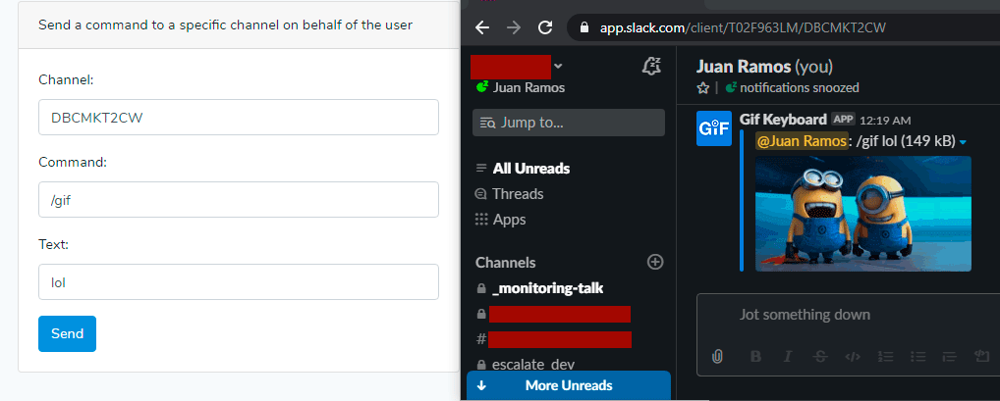

## About this project

I belong to several Slack workplaces with multiple channels.

Some bot users publish messages on those channels, with options.

For this experiment: 

I want to reply automatically to the messages I'm interested in, before anyone else.

## Examples

Besides the Slack events and actions taken, I added 2 basic forms, to send messages and commands.

Here is a screenshot example:

Note: In order to send a command you will need a [legacy-token](legacy token), 
because the corresponding scope does not exist in the current version.

[legacy-token]: https://stackoverflow.com/a/43868371/3692788